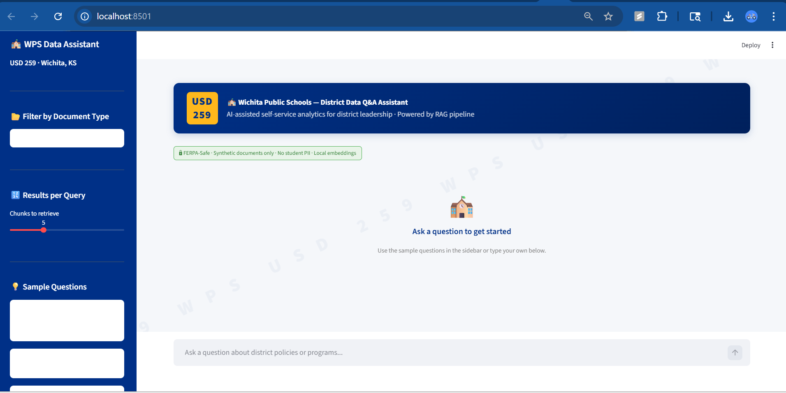

# WPS Analytics Suite — USD 259 Wichita Public Schools

A two-project analytics portfolio built around real challenges faced by K-12 district data teams.
Both projects use synthetic data only — no student PII, no real staff records, FERPA-safe by design.

---

## Projects

### 1. District Assessment Pipeline
**Folder:** `district-assessment-pipeline/`

An end-to-end data pipeline that ingests K-12 assessment data, transforms it through a SQLite warehouse,
and surfaces insights through an interactive dashboard — built to show how a district analyst moves raw
assessment records from collection to decision-ready reporting.

**What it does:**
- Ingests synthetic student assessment records across subjects and grade bands
- Loads into a structured SQLite database with a clean schema
- Produces aggregated summaries by school, subject, and grade band
- Visualizes trends through an interactive Streamlit dashboard

**Tools:** Python · SQLite · Pandas · Streamlit · Plotly

---

### 2. District RAG Q&A Assistant
**Folder:** `district-rag-assistant-2026/`

A retrieval-augmented generation (RAG) chatbot that lets district leadership ask natural language
questions over a corpus of 60 synthetic policy and assessment documents — no SQL, no search filters,
just plain English. Built to demonstrate AI-assisted self-service analytics, a priority explicitly
called out in the USD 259 Data Analyst job description.

**Live Demo:** *(Streamlit Cloud link — add after deploy)*

#### App Screenshots

**Chat interface — answering a question about Science rubrics:**



#### What it does:
- Generates 60 synthetic district documents (assessment rubrics, graduation policies, program evaluations)
- Chunks and embeds documents into a local ChromaDB vector store using ONNX-based embeddings
- Retrieves top-5 relevant chunks per query using cosine similarity
- Passes context to an LLM via OpenRouter to generate grounded answers
- Serves a Streamlit chat UI with WPS branding, document type filters, and sample questions
- Evaluates pipeline quality with a RAGAS-style scorecard across 20 test QA pairs

#### FERPA-Safe Design:
- All embeddings computed locally — no document content sent to cloud for indexing
- Corpus contains zero student-level PII (aggregate/program data only)
- LLM system prompt explicitly instructs: "Do not reference or infer individual student data"
- ChromaDB stored entirely on local disk (`chroma_db/` gitignored)

#### RAGAS Evaluation Results (20 QA pairs, synthetic corpus):

| Metric | Score | Notes |
|---|---|---|
| Context Precision | 0.970 | Retrieved chunks are almost always from the correct document type |
| Context Recall | 0.528 | Context covers roughly half of ground truth content per query |
| Faithfulness | 0.254 | Lower score reflects LLM reformatting answers into markdown — not hallucination |

**Tools:** Python · ChromaDB · HuggingFace ONNX Embeddings · OpenRouter API · Streamlit · Matplotlib

---

## Architecture — RAG Pipeline

```
User Question
     │
     ▼
[ChromaDB] ── embed query ──► cosine similarity search ──► top-5 chunks
     │
     ▼
[OpenRouter LLM] ◄── system prompt (FERPA note + grounding instruction)
     │
     ▼
Answer + Source Citations ──► Streamlit UI
```

---

## How to Run — RAG Assistant

```bash
# 1. Install dependencies
pip install chromadb faker python-dotenv requests matplotlib streamlit

# 2. Add your OpenRouter API key
echo "OPENROUTER_API_KEY=your-key-here" > district-rag-assistant-2026/.env

# 3. Generate synthetic documents
python district-rag-assistant-2026/src/generate_documents.py

# 4. Chunk and embed into ChromaDB
python district-rag-assistant-2026/src/ingest.py

# 5. Launch the chatbot
streamlit run district-rag-assistant-2026/app.py

# 6. Run RAGAS evaluation (optional)
python district-rag-assistant-2026/src/evaluate.py
```

---

## FERPA Compliance Notes

This project was designed with FERPA principles in mind even though it uses synthetic data:

- **No cloud embedding:** Document chunks are embedded using a local ONNX model via ChromaDB default. No document text leaves the machine during indexing.
- **No PII in corpus:** All 60 documents contain only aggregate program and policy data. Faker is used for staff/approver names in headers only — not student records.
- **LLM grounding:** The system prompt instructs the model to answer only from provided context and explicitly prohibits referencing individual student data.
- **Local vector store:** ChromaDB persists to disk and is excluded from version control via `.gitignore`.

---

## About

Built by **Haribabu Ambati** — MSBA '26, Wichita State University (Barton School of Business)

Targeting: Data Analyst roles in K-12 education analytics, AI/ML, and operations

GitHub: [ambtiharibabu](https://github.com/ambtiharibabu)
LinkedIn: [haribabuambati](https://linkedin.com/in/haribabuambati)
