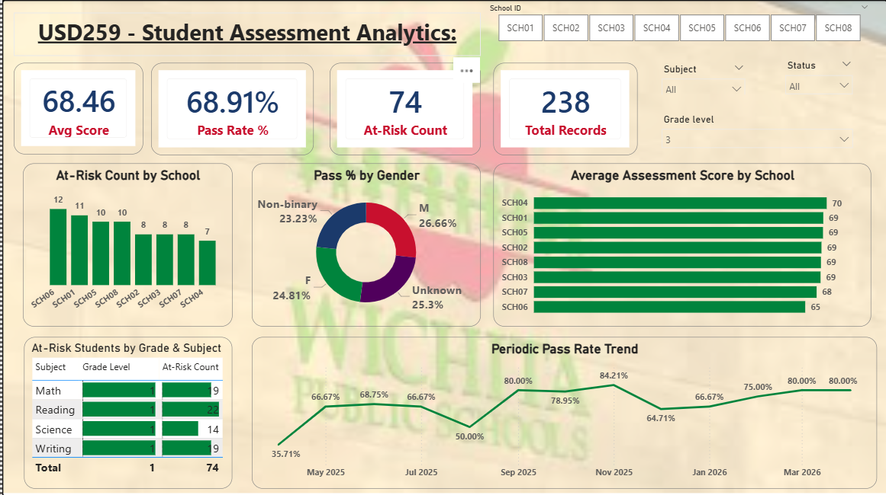

# USD 259 — Student Assessment Analytics Pipeline

**Data Analysis Project:**  for Wichita Public Schools (USD 259)  
**Built by:** Haribabu Ambati | [LinkedIn](https://linkedin.com/in/haribabuambati) | [GitHub](https://github.com/ambtiharibabu)

---
## What This Project Does

End-to-end K-12 analytics pipeline that ingests synthetic district assessment data,
cleans and transforms it via Python/pandas (simulating Power Query logic), loads it
into SQLite for SQL-based joins, and surfaces insights in a Power BI dashboard with
DAX measures and a star schema semantic model.

---

## Dashboard Preview



---

## Project Structure
```
district-assessment-pipeline/
├── data/
│   ├── raw/                  # 3 Faker-generated CSVs (as-received)
│   └── processed/            # Cleaned fact table after pipeline
├── src/
│   ├── generate_data.py      # Synthetic data generation with quality issues
│   ├── transform_pipeline.py # Cleaning, dedup, null handling, SQL joins
│   └── export_excel.py       # 3-sheet stakeholder Excel export
├── outputs/
│   ├── district_assessment_model.pbix
│   ├── stakeholder_report.xlsx
│   └── pipeline_log.txt
├── requirements.txt
└── README.md
```

---

## Data Dictionary

### assessments (raw)
| Column | Type | Description |
|---|---|---|
| student_id | string | Unique student identifier (STU0001–STU0600) |
| school_id | string | School identifier (SCH01–SCH08) |
| grade_level | integer | Grade 3–8 |
| subject | string | Math, Reading, Science, Writing |
| assessment_date | date | Test date (past 12 months) |
| score | float | Raw score 0–100, bell curve ~68 avg |
| pass_fail | string | Pass / Fail — rebuilt from score >= 60 in pipeline |

### attendance (raw)
| Column | Type | Description |
|---|---|---|
| student_id | string | Unique student identifier |
| school_id | string | School identifier |
| date | date | Attendance date |
| present_flag | integer | 1 = present, 0 = absent |
| absence_reason | string | Illness / Family / Unknown / Vacation / null |

### demographics (raw)
| Column | Type | Description |
|---|---|---|
| student_id | string | Unique student identifier |
| ethnicity | string | Hispanic / White / Black / Asian / Two or More |
| gender | string | M / F / Non-binary |
| free_lunch_eligible | integer | 1 = eligible, 0 = not eligible |
| special_ed_flag | integer | 1 = special education, 0 = standard |
| grade_level | integer | Grade 3–8 |

### fact_assessments (processed)
All columns above merged, plus:
| Column | Type | Description |
|---|---|---|
| at_risk_flag | integer | 1 if score < 60 (failing threshold) |

---

## Governance Decisions

| Decision | Choice | Reason |
|---|---|---|
| Null scores | Dropped | Cannot impute a test score — would distort averages |
| Null pass_fail | Rebuilt from score | score >= 60 = Pass is the standard district threshold |
| Demographic nulls | Filled with 'Unknown'/0 | Preserve assessment records — don't lose test data over missing demo |
| Duplicate rows | Dropped on student+school+subject+date+score | Exact match = data entry error, not a retake |
| Join mismatches | Kept with 'Unknown' demographics | 264 assessment rows had no demographics match — still valid test records |

---

## Naming Conventions

- All column names: `snake_case` (lowercase, underscore-separated)
- Table prefix convention: `fact_` for fact tables, `dim_` for dimension tables
- Flag columns: `_flag` suffix, integer 0/1
- ID columns: `_id` suffix

---

## Pipeline Log

See `outputs/pipeline_log.txt` for a full record of every data quality issue
detected and every cleaning decision made during the transformation run.

---

## How to Refresh the Pipeline
```bash
pip install -r requirements.txt
python src/generate_data.py       # regenerates raw CSVs
python src/transform_pipeline.py  # cleans + rebuilds fact table
python src/export_excel.py        # rebuilds stakeholder Excel
```

Then open `outputs/district_assessment_model.pbix` in Power BI Desktop
and click **Refresh** to reload the updated CSVs.

---

## FERPA Note

This project uses 100% synthetic data generated via the Python Faker library.
No real student records, names, or personally identifiable information (PII)
were used at any stage. All student_id and school_id values are randomly generated.

---

## Key Results

| Metric | Value |
|---|---|
| Raw assessment rows | 1,545 |
| Duplicates dropped | 45 |
| Null scores removed | 126 |
| Join mismatches flagged | 264 |
| Final clean rows | 1,374 |
| At-risk students flagged | 414 |
| Schools analyzed | 8 |

---

## Tools Used

| Tool | Purpose |
|---|---|
| Python 3.12 + Faker | Synthetic data generation |
| pandas | Data cleaning and transformation |
| SQLite (sqlite3) | Relational storage and SQL JOIN |
| Power BI Desktop | Star schema, DAX measures, dashboard |
| openpyxl | Formatted Excel stakeholder export |
| Git + GitHub | Version control and portfolio hosting |